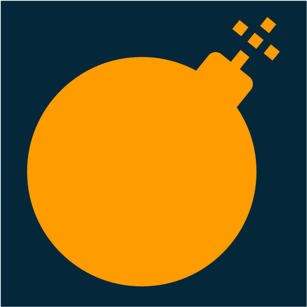

#  AWS-Bomb-Slack-App

Clean Up AWS Resources within Slack using [aws-nuke](https://github.com/rebuy-de/aws-nuke)

> [!CAUTION]
> ARM Architecture not supported yet! If you're a ARM(Mac, RaspberryPi ...) user, please try [Cloud9](https://us-east-1.console.aws.amazon.com/cloud9control/home) to deploy your slack app.

<br/>

# Used
- [Slack Bolt for Python](https://github.com/slackapi/bolt-python)
- [AWS CLI](https://aws.amazon.com/ko/cli/)
- [AWS SAMCLI](https://docs.aws.amazon.com/ko_kr/serverless-application-model/latest/developerguide/install-sam-cli.html#install-sam-cli-instructions)
- [Docker](https://docs.docker.com/engine/install/)
- [aws-nuke](https://github.com/rebuy-de/aws-nuke)

<br/>

# Project Structure
```
📦aws-bomb-slack-app
 ┣ 📂docs
 ┃ ┗ 📜logo.png
 ┣ 📂src
 ┃ ┣ 📂external
 ┃ ┃ ┗ 📜aws-nuke-v2.25.0-linux-amd64.tar.gz
 ┃ ┣ 📂listeners
 ┃ ┃ ┣ 📂handlers
 ┃ ┃ ┃ ┗ 📜bomb.py
 ┃ ┃ ┗ 📜commands.py
 ┃ ┣ 📜app.py
 ┃ ┗ 📜requirements.txt
 ┣ 📜.gitignore
 ┣ 📜Dockerfile
 ┣ 📜LICENSE
 ┣ 📜README.md
 ┗ 📜template.yaml
```

<br/>

# Features
- `/bomb [Region_Name]`
    - **Remove AWS Resources in Selected Region**

<br/>

# Installation
- Lambda Functions and S3 Buckets are needed to deploy a Slack App.
  
  *Slack App 배포를 위해 Lambda 함수와 S3 버킷이 사용됩니다.*

- Charges may apply based on Lambda/S3 usage in your AWS billing.
  
  *Lambda와 S3 사용량에 따라 AWS 요금이 부과될 수 있습니다.*